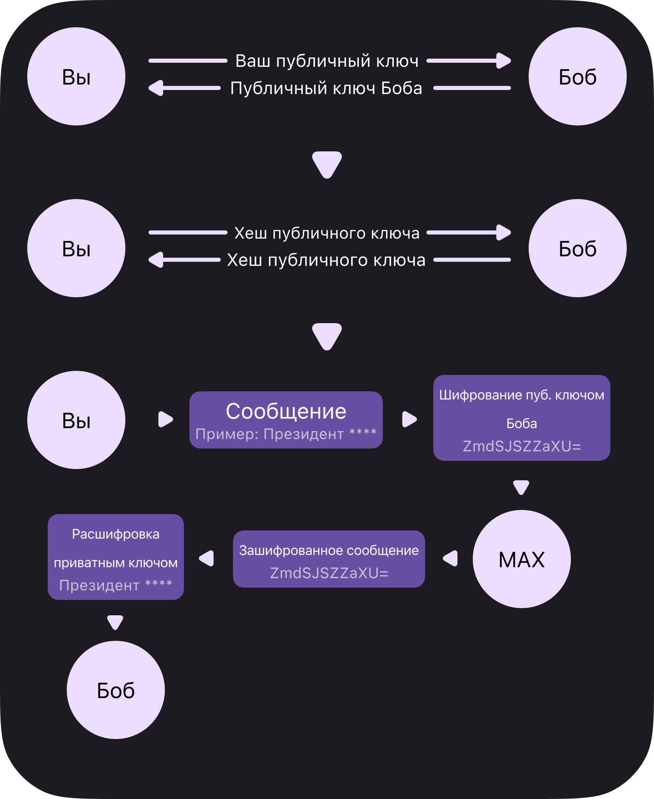

# Hmmm
Hmmm (Hide My MAX Messages) - проект для автономного шифрования сообщений в мессенджерах.
В первую очередь проект создан для шифрования сообщений из мессенджера MAX, но также может использоватся для работы с любыми мессенджерами поддерживающими отправку файлов

# Как работает Hmmm?

    
    
Работа Hmmm

### 1. Генерация пар ключей и обмен публчиными ключами
Сначала, Вы и Боб запускаете `gen.py`.
Этот код сгенерирует вашу связку ключей.

> [!IMPORTANT]
НИКОГДА не делитесь приватным ключем!